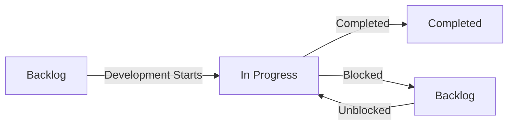

# Features Directory

This directory manages feature development for PortfolioProtector using user stories and technical specifications.

## 🚨 MANDATORY READING
- **[Development Rules](./development-rules.md)** - MUST follow for every feature
- **[Agent Guide](./agent.md)** - How AI agents should execute features
- **[Code Review Standards](../docs/CODE_REVIEW_STANDARDS.md)** - Quality requirements

## 📁 Directory Structure

```
features/
├── README.md              # This file
├── development-rules.md   # Mandatory process rules
├── agent.md              # AI agent guidance
├── backlog/              # Features waiting to be implemented
│   └── feature-name/     # One directory per feature
│       ├── README.md     # Feature overview
│       ├── user-story.md # Acceptance criteria
│       ├── spec.md       # Technical design
│       ├── implementation-plan.md # Phased tasks
│       ├── agent-notes.md # AI-specific guidance
│       └── test-data/    # Sample data if needed
├── in-progress/          # Features currently being developed
│   └── feature-name/     # Entire directory moves here
├── completed/            # Successfully delivered features
│   └── feature-name/     # Archived with completion notes
└── templates/            # Standardized templates
    ├── user-story-template.md
    └── spec-template.md
```

## 🚀 Feature Development Workflow

### 1. Feature Request
- User or stakeholder identifies a need
- Initial discussion to validate the requirement
- Decision to proceed with formal planning

### 2. Create Feature Directory
- Create new directory in `backlog/feature-name/`
- Add README.md for feature overview
- Create user-story.md using template
- Create spec.md with technical details
- Add implementation-plan.md with phases
- Add agent-notes.md for AI guidance
- Include test-data/ if needed

### 3. Get Approval
- Review user story with stakeholders
- Technical review of specification
- Confirm resource availability
- Set target timeline

### 4. Development Start
- Move entire feature directory to `in-progress/`
- Create feature branch
- Begin Phase 1 (Documentation review)
- Update TodoWrite for task tracking

### 5. Implementation
- Follow the technical specification
- Regular commits with clear messages
- Update documentation as needed
- Test thoroughly

### 6. Completion
- All acceptance criteria met
- Code reviewed and approved
- Tests passing
- Move entire feature directory to `completed/`
- Add completion date to feature README

## 📋 Current Status

### 🔴 High Priority Backlog
1. **Option Strategy Recognition** - Intelligent detection of spreads vs single legs
2. **Real-time Alerts** - Price and Greeks threshold notifications
3. **Mobile Responsive Design** - Tablet and phone optimization

### 🟡 In Progress
(Check `in-progress/` directory for active work)

### 🟢 Recently Completed
(Check `completed/` directory for delivered features)

## 📝 Directory & File Naming Convention

### Feature Directories
```
feature-name/                    # Kebab-case, descriptive
├── README.md                    # Feature overview
├── user-story.md               # Always named exactly this
├── spec.md                     # Always named exactly this
├── implementation-plan.md      # Always named exactly this
├── agent-notes.md              # Always named exactly this
└── test-data/                  # Optional, for test files
```

### Example
```
option-strategy-recognition/
├── README.md
├── user-story.md
├── spec.md
├── implementation-plan.md
├── agent-notes.md
└── test-data/
    └── sample-portfolio.json
```

### Linking
- Use relative paths within feature: `./user-story.md`
- Reference parent directories: `../../docs/`

## ⚠️ Development Process

**CRITICAL**: All features MUST follow the [development-rules.md](./development-rules.md) phases:
1. Phase 1: Documentation & Planning (no code)
2. Phase 2: Backend Implementation (with testing)
3. Phase 3: Frontend Implementation (with testing)
4. Phase 4: Integration Testing
5. Phase 5: Deployment Preparation

**Each phase requires user verification before proceeding!**

## 🎯 Best Practices

### For User Stories
1. **Focus on user value** - Why does this matter?
2. **Clear acceptance criteria** - How do we know it's done?
3. **Realistic estimation** - Account for testing and documentation
4. **Include test scenarios** - Real examples to validate against

### For Technical Specifications
1. **Complete architecture** - All affected components
2. **API contracts** - Request/response examples
3. **Error handling** - What can go wrong?
4. **Performance targets** - Speed and scale requirements
5. **Rollback plan** - How to undo if needed

### For Development
1. **Follow the spec** - Deviations need documentation
2. **Update as you learn** - Specs are living documents
3. **Test early and often** - Especially edge cases
4. **Communicate blockers** - Don't wait to raise issues

## 🔄 State Transitions



## 📊 Tracking Metrics

### Per Feature
- **Lead Time**: Time from backlog → completed
- **Cycle Time**: Time in progress
- **Defect Rate**: Bugs found post-completion
- **Estimation Accuracy**: Actual vs estimated effort

### Overall
- **Features Completed/Month**
- **Average Cycle Time**
- **Backlog Size**
- **Technical Debt Ratio**

## 🤝 Contributing

### Adding a New Feature
1. Use templates from `templates/`
2. Start in `backlog/`
3. **Read and follow [development-rules.md](./development-rules.md)**
4. Get approval before moving to `in-progress/`
5. Follow naming conventions
6. **Consult [agent.md](./agent.md) for AI-assisted development**

### Updating Existing Features
1. Edit files in place
2. Document changes in commit message
3. Update related documentation

### Archiving Completed Work
1. Move to `completed/` when done
2. Add completion date to file
3. Update this README if high-impact

## 🔍 Quick Links

### Templates
- [User Story Template](./templates/user-story-template.md)
- [Technical Spec Template](./templates/spec-template.md)

### Current High Priority
- [Option Strategy Recognition](./backlog/option-strategy-recognition/) - Fix critical strategy detection bug

### Documentation
- [Main Architecture](../ARCHITECTURE.md)
- [Code Review Standards](../docs/CODE_REVIEW_STANDARDS.md)
- [Bug Reports](../docs/bugs-and-fixes/)

## ❓ FAQ

**Q: When should I create a user story?**
A: For any feature that changes user-facing behavior or adds new capabilities.

**Q: Do bug fixes need user stories?**
A: No, bugs go in `/docs/bugs-and-fixes/`. Only enhancement requests need stories.

**Q: Can I edit a spec after starting development?**
A: Yes, but document why in the spec and communicate to the team.

**Q: How detailed should acceptance criteria be?**
A: Detailed enough that someone unfamiliar with the feature can verify it works.

**Q: What if a feature is too large?**
A: Break it into multiple user stories that can be delivered independently.

## 📞 Contact

For questions about features or this process:
- Check existing documentation first
- Review similar completed features
- Ask in team channels

---

*Last Updated: January 2025*